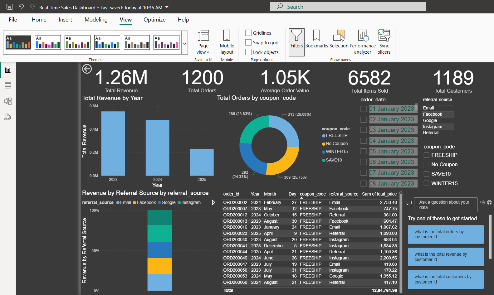

# Real-Time-Sales-Dashboard(Power BI)

This is a Power BI dashboard built from an online store orders dataset.

## Features
- KPIs: Total Revenue, Total Orders, Average Order Value
- Sales trend over time
- Coupon usage breakdown
- Revenue by referral source

## File
- `Real-Time Sales Dashboard.pbix` → Open in Power BI Desktop to view.

## Screenshot

